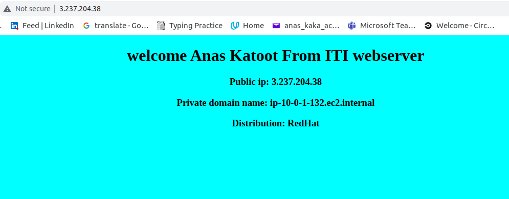
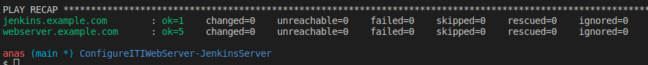
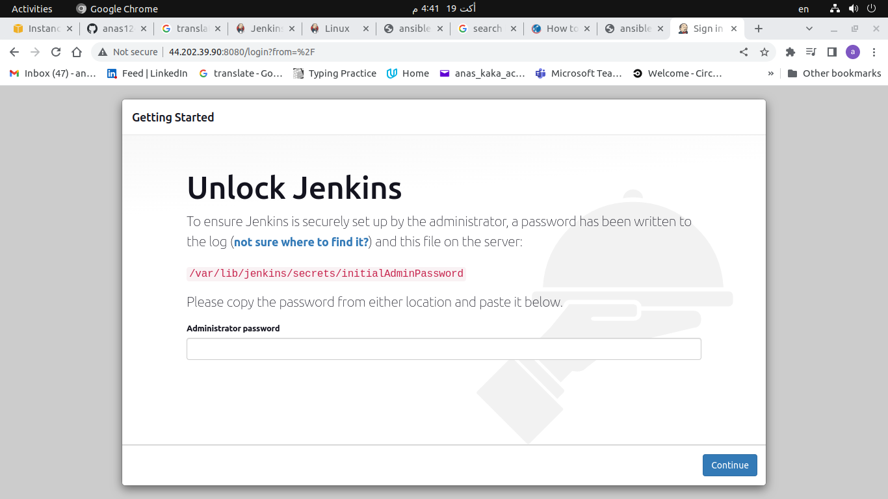
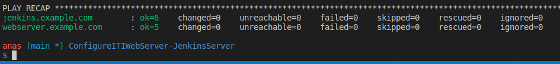

# Configure ITI webserver and Jenkins agents server using Ansible following best practices

## Best practices followed

1. Make a separate role for configuring ITI web server
2. Insure that any argument may change in the future become a variable EX. nginx may be replaced with apache
3. Use ansible-galaxy init to make sure everything is organized
4. Variables that future users may change are places in the default directory under the ITI role
5. IPs are given through the variable inventory_hostname=[ip] inside host_vars directory ather than hardly coded inside the inventory

### ITI webserver

- 

- 

### Jenkins Server

- 

- 
